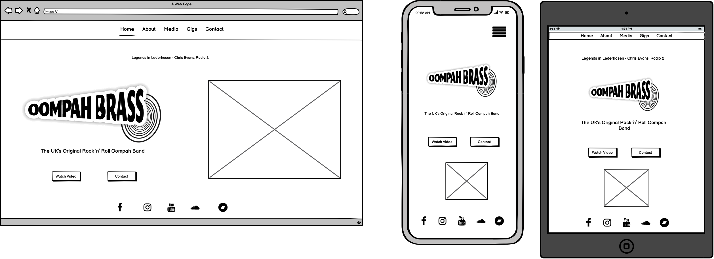
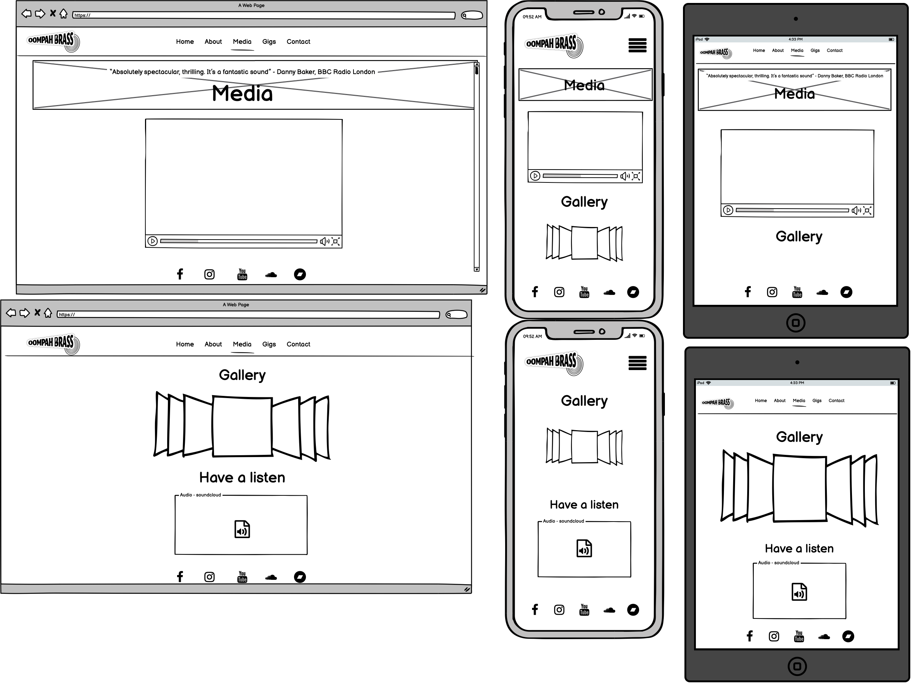
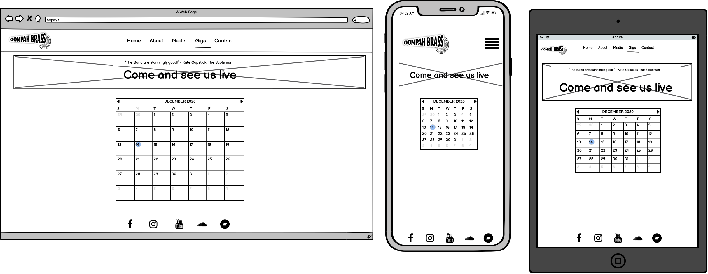

# Website for a band

------

&#127930;&emsp; [View Project Here](https://olihickie.github.io/band_project/)&emsp;&#127930;

&#x1F3B5;&emsp; [View GitHub Repository Here](https://github.com/OliHickie/band_project)&emsp;&#x1F3B5;

This is a website for a group named **Oompah Brass**. They are a five piece brass group whose varied gigs include regular residences, large oktoberfest events, weddings and corporate functions. Their show, which generally includes upbeat pop covers, is upbeat, energetic and fun and the overall aim of their website is to reflect this.

# User Experience (UX)

## User Stories

  - As a potential client visiting the website I want them to:
    - Navigate their way around the website without any help or confusion. 
    - Get a good first impression of the band, that of being both fun and professional. 
    - From the homepage, be able to quickly navigate to a promotional video and a way of contacting the band.  
    - Read a bit about the band, their achievements, collaborations and past performances. 
    - Read various testimonials from well-known people offering their opinion of the band. 
    - View all external links in a separate window so not to get taken away from the website. 
    - View inspiring photos designed to encourage bookings.

  - As a fan of the band visiting the website I want them to:
    - Be able to listen to music published by the band.
    - Easily navigate to social media pages in separate windows. 
    - View a list of upcoming gigs that members of the public are able to go and watch.
    - Follow links to venues of live gigs for more information. 

## Design

  - Color Scheme
    
    The three main colours used for the website are white, black and a bright pink, which links in with the bands costumes (for corporate events) and business cards. The bright pink also offers a vibrant contrast against both white and black, which makes key elements stand out. The use of a black background not only gives the site a professional look but is easier on the eyes.

  - Typography 
    
    The two fonts used are Raleway and Roboto Slab, both with a fallback option of sans-serif. Raleway is an elegant font which has been used for the navigation bar, the quote in the banner at the top and for the large amount of text on the about.html page. Roboto Slab is a very clear font that is also very easy to read. With that in mind, I have used Roboto Slab for titles, subtitles, buttons and the form. 

  - Imagery

    Imagery is an important part of the website as it portrays the energy of the band at various gigs they have performed at. 
      - The band logo is visible at the top of each page. This also acts as a quick link to the home page. The logo is also a main image on the home page. 
      - A common image of the band singing on stage is used at the top of each page. This helps to link all the pages together for a better UX.
      - Various images are used in the body of each page with a selection of images available on the media page. 

  - Wireframes

    Below are the wireframes which were created using Balsamiq, each designed using three different screen sizes. 

    ### Home 

    

    ### About 

    

    ### Media 

    

    ### Gigs 

    

    ### Contact 

    

    #### Changes 

    During the building of the website, a few changes took place for a better UX.
    - Firstly, the navigation links were moved to the left of the navigation bar, as, when central, it left an unbalanced view of the top of the page with the logo on the left, and nothing on the right. 
    - The image across the top of most pages was included on the home page for a better sense of continuity. 
    - The quote on the about page was included in smaller devices, but below the image. 
    - The calendar view on the gigs page was changed to an ordered list. 
    - I made use of a form on the contact page instead of a list of details. 

# Features 

## Existing Features

- **Header** The header is the came across all five pages, the only difference being the active page being bold and underlined. The header consists of the band logo on the left-hand side, which also links to the home page. There are also five navigational links to each page which change to a pink colour when hovered over. This navigation bar collapses into a hamburger button on mobile devices. The Navigation bar is in a fixed position and always visible to allow for quick and easy access to other pages. 
- **Banner** A background image has been used consistently across all five pages. On this, there is a quote highlighted by a light pink banner. This quote changes on each page along with the title of the page. The quote disappears on mobile devices to avoid the top of the page looking too overcrowded. 
- **Footer** The footer section is in a sticky position at the bottom of the page. This was done using Bootstrap classes. It houses five navigation links to social media pages which open in a separate window. These icons change colour when the mouse hover over them.
- **Home Page** The home page includes two links that look like buttons. These navigate to the media page and contact page for quick and obvious access. They react when hovered over for better UX. The large logo has been removed for smaller devices as it was not deemed necessary to repeat the logo so close to the navigation bar. 
- **About Page** The biography is both informative and functional. Within the text are links to internal pages and external pages in separate windows. They change colour slightly when hovering over the words and are written in the sites pink colour to highlight them. 
- **Media Page** The media page consists of three separate sections. A video embedded from YouTube, a Bootstrap carousel and a playlist of music embedded from Soundcloud. 
- **Gigs Page** As well as a list of upcoming gigs, there are also external links to venue sites which open in a separate browser. 
- **Contact Page** This page consists of a Bootstrap form which uses placeholder text as labels for good UX. There are labels for screen readers. There is also a responsive button to submit the form when all areas have been completed. 

## Future Features

Going forward, I would like to include 
- A responsive diary that links to and updates with the band calendar to save manually updating the gigs list. 
- A page where clients can offer feedback for events the band have performed at.
- A banner on the homepage to advertise latest news, events or releases. 

# Technology Used 

## Languages
  - HTML5
  - CSS3

## Frameworks, Libraries and Programs Used
  - [Bootstrap v.4.5](https://getbootstrap.com/) - Used for layout and positioning of elements, navigation bar and sticky footer. It was used to create the hamburger button for the collapsible menu. Also, I used this for the carousel on the media page and the contact form. 
  - [jQuery](https://jquery.com/) - This was used to create a collapsible, clickable hamburger button for mobile screens.
  - [Font Awesome](https://fontawesome.com/) - I used icons taken from this website for the social media links in the footer. 
  - [Google Fonts](https://fonts.google.com/) - This is where I imported my two fonts for the site; "Roboto Slab" and "Raleway".
  - [Git, GitPod and GitHub](https://github.com/) - Git was used for version control, GitPod hosted the coding space before using GitHub to store the repository and launch the page on Git Pages. 
  - [Fotor Photo Editor](https://www.fotor.com/) - This software was used to edit images for the page. 
  - [Balsamiq](https://balsamiq.com/) - This platform was used to create my Wireframes. 
    
# Testing

## Functionality Testing 

  - **Header** 
    - When the logo in the top left corner of the page is clicked, it takes you back to the home page for any of the five pages. This has been tested on a computer and mobile device. 
    - All page links work and stay active when clicked. 
    - On mobile devices, the navigation bar collapses into a button which, when clicked, drops down and displays the page links. 
    - The Navigation bar is always at the top of the page and is  visible when scrolling down the page.
  - **Footer** 
    - The footer contains five social media icons. These each lead to external pages in a new window and has been tested on computer and mobile devices.
    - The footer is stuck to the bottom of the page and was tested by temporarily removing page material. 
  - **Buttons/Links** 
    - All internal links were tested on desktop and mobile to check that they navigate to the correct page. The media link in the biography leads to the music section at the bottom of the media page. 
    - All external links were tested on desktop and mobile and ensured that they opened in new tabs. 
  - **Media Page** 
    - The video was tested on the media page on various different screen sizes to check that it played and was responsive.
    - The images on the carousel automatically rotate and can be moved manually using the arrows and the bars at the bottom of the screen. 
    - The soundcloud playlist plays when clicked and can be controlled using buttons within the window. 
  - **Form** 
    - The form deletes it's placeholder text when you start to write content in a box. 
    - You cannot submit the form unless all three boxes have content. 

## Validation

### CSS3 
The list items on the gigs page were slightly off-centre due to a bootstrap style; padding-inline-start: 40px. I had cancelled this out but this flagged up as an error when checked using the [CSS Validator](https://jigsaw.w3.org/css-validator/). Instead, I set the padding: 0; and, after this change, the code passed the validation test. 

### HTML 

When using the [HTML Validator](https://validator.w3.org/), all code passed without errors. 

## Compatability Testing
Throughout the building process, the site was regularly checked using Chrome DevTools, checking for responsiveness across various screen sizes. Once the site had been completed, it was then checked on Safari and Chrome browsers, Apple and Samsung tablets and various mobile devices including Apple and Google. Throughout these tests, all links, menus, forms and media windows functioned as expected.  

### Lighthouse

I conducted tests using the [Lighthouse](https://developers.google.com/web/tools/lighthouse) feature on Chrome DevTools and after analysing the results, I made the following changes.
  - I added a meta description to the 'head' section of each page to summarise the page for the benefit of search engines. 
  - I added text to the social media icons for screen readers. 
  - I added rel="noopener" to all external links to ensure I don't expose the site to performance or security issues. 
  - On the About Us page, my links initially said 'Click here' and I changed them to more descriptive text, clearly stating the destination of the links. 
  - On the Media page, I added titles to the YouTube and Soundcloud windows. 
  - On the Contact page, I added labels to the form that were only visible for screen readers. 

Overall, this helped improve the performance, accessibility, best practices and SEO scores; the results of which are below.

### Index 

### About Us

### Media

### Gigs

### Contact

## Testing User Stories

  - As a potential client visiting the website I want them to:
    - Navigate their way around the website without any help or confusion. _The home page is simple, with an obvious, fixed navigation bar and brightly coloured links. All external links open in separate browsers, so not to confuse the user._
    - Get a good first impression of the band, that of being both fun and professional. _The bright pink and entertaining imagery gives the impression of a fun group along with complimentary quotes from industry professionals._
    - From the homepage, be able to quickly navigate to a promotional video and a way of contacting the band. _The two bright links below the subheading direct straight to a promotional video or the contact form._  
    - Read a bit about the band, their achievements, collaborations and past performances. _This is available on the About page, which is easily accessible via the navigation bar._
    - Read various testimonials from well-known people offering their opinion of the band. _Quotes are visible on each page on the heading and change depending on what page you are on._
    - View all external links in a separate window so as to not get taken away from the website. _The external links for social media and venue information all open in separate browsers._
    - View inspiring photos designed to encourage bookings. _Images are used on all pages with a carousel available on the media page._

  - As a fan of the band visiting the website I want them to:
    - Be able to listen to music published by the band. _A soundcloud playlist is available on the media page, along with YouTube and Bandcamp links in the footer of every page._
    - Easily navigate to social media pages in separate windows. _The social media pages are linked to icons in the footer of each page._
    - View a list of upcoming gigs that members of the public are able to go and watch. _A list of gigs is available on the Gigs page which is easily accessible via the navigation bar._
    - Follow links to venues of live gigs for more information. _The list items also include links to venue websites for more information._

# Observations

At the beginning of the project good git work flow wasn't adhered to. After some advice from my mentor, I used the commit function more regularly and when large changes and continued to do so. 

# Deployment

The site was deployed using [GitHub Pages](https://pages.github.com/) using the following steps. 

  1. Log into [GitHub](https://github.com/).
  2. Go to the required repository which can be found [here](https://github.com/OliHickie/band_project).
  3. In the submenu, click the settings tab and scroll down to GitHub Pages.
  4. Change the source to 'master branch' and, when the page reloads, copy the link (which has now been created) into your browser. 

To clone the site follow the steps below.

  1. Log into [GitHub](https://github.com/).
  2. Go to the required repository which can be found [here](https://github.com/OliHickie/band_project).
  3. Next to the green 'Gitpod' button, click the drop down menu that says 'code'. 
  4. Copy the url provided. 
  5. Open the terminal that you would like to use to clone the site and enter 'git clone' followed by the copied url. When you press enter, the code will be cloned. 

  # Credits

  - All videos, images and music is owned by [Oompah Brass](https://oompahbrass.com/)
  - [Bootstrap](https://getbootstrap.com/) was used to create styling and layout, responsiveness, the navigation bar, dropdown menu, sticky footer, image carousel and contact form. 

  ## Acknowledgments

  - I used the following sites as inspiration; 
    - [Oompah Brass](https://oompahbrass.com/)
    - [Backchat Brass](https://backchatbrass.com/)
    - [Awwwards](https://www.awwwards.com/)

  - I used the following documents to help with my README file
    - [Code Institute README Template](https://github.com/Code-Institute-Solutions/readme-template)
    - [Code Institute Sample README](https://github.com/Code-Institute-Solutions/SampleREADME)
    - [Boredom Guide README](https://github.com/LigaMoon/Boredom-guide)

I would like to thank my Mentor for his continued support and help on this project, and the Code Institute Tutor team for their help when working on this site. 

