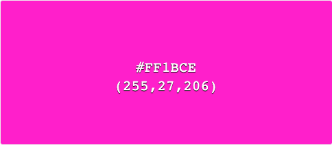
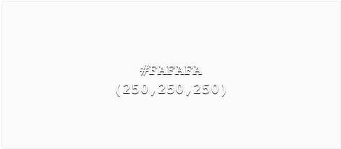
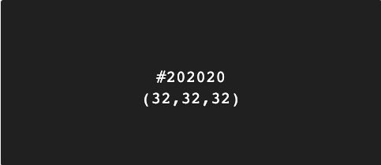

# Website for a band

------

&#127930;&emsp; [View Project Here](https://olihickie.github.io/band_project/)&emsp;&#127930;

&#x1F3B5;&emsp; [View GitHub Repository Here](https://github.com/OliHickie/band_project)&emsp;&#x1F3B5;

This is a website for a group named **Oompah Brass**. They are a five piece brass group whose varied gigs include regular residences, large oktoberfest events, weddings and corporate functions. Their show, which generally includes upbeat pop covers, is upbeat, energetic and fun and the overall aim of their website is to reflect this.

# User Experience (UX)

## User Stories

  - As a potential client visiting the website I want them to:
    - Navigate their way around the website without any help or confusion. 
    - Get a good first impression of the band, that of being both fun and professional. 
    - From the homepage, be able to quickly navigate to a promotional video and a way of contacting the band.  
    - Read a bit about the band, their acheivements, collaborations and past performances. 
    - Read various testimonials from well-known people offering their opinion of the band. 
    - View all external links in a separate window so as to not get taken away from the website. 
    - View inspiring photos designed to encourage bookings.

  - As a fan of the band visiting the website I want them to:
    - Be able to listen to music published by the band.
    - Easily navigate to social media pages in serparate windows. 
    - View a list of upcoming gigs that members of the public are able to go and watch.
    - Follow links to venues of live gigs for more information. 

## Design

  - Color Scheme
    
    The three main colours used for the website are white, black and a bright pink, which links in with the bands costume (for corporate events) and business cards. The bright pink also offers a vibrant contrast against both white and black which makes key elements stand out. The use of a black background not only gives a professional look but is also easier on the eyes.

       

  - Typography 
    
    The two fonts used are Raleway and Roboto Slab, both with a fallback option of sans-serif. Raleway is an elegant font which has been used for the navigation bar, the quote in the banner at the top and for the large amount of text on the about.html page. Roboto Slab is a very clear font that is also very easy to read. With that in mind, I have used Roboto Slab for titles, subtitles, buttons and the form. 

  - Imagery

    Imagery is an important part of the website as it portrays the energy of the band at various gigs they have performed at. 
      - The band logo is visable at the top of each page. This also acts as a quick link to the home page. The logo is also a main image on the home page. 
      - A common image of the band singing on stage is used at the top of each page. This helps to link all the pages together for a better UX.
      - Various images are used in the body of each page with a selection of images available on the media page. 

  - Wireframes

    Below are the wireframes which were created using Balsamiq, each designed using three different screen sizes. 

    ### Home 

    

    ### About 

    

    ### Media 

    

    ### Gigs 

    

    ### Contact 

    

    #### Changes 

    During the building of the website, a few changes took place for a better UX.
    - Firstly, the navigaton links were moved to the left of the navigatoin bar, as, when central, it left an unbalanced view of the top of the page with the logo on the left, and nothing on the right. 
    - The image across the top of most pages was included on the home page for a better sense of continuity. 
    - The quote on the about page was included in smaller devices, but below the image. 
    - The calendar view on the gigs page was changed to an ordered list. 
    - I made use of a form on the contact page instead of a list of details. 

# Features 

## Existing Features

- **Header** The header is the came across all five pages, the only difference being the active page being bold and underlined. The header consists of the band logo on the left hand side, which also links to the home page. There are also five navigational links to each page which change to a pink colour when hovered over. This navigation bar collapses into a hamburger button on mobile devices. The Navigation bar is in a fixed position and always visable to allow for quick and easy access to other pages. 
- **Banner** A background image has been used consistantly across all five pages. On this, there is a quote highlighted by a light pink banner. This quote changes on each page along with the title of the page. The quote disappears on mobile devices to avoid the top of the page looking too overcrowded. 
- **Footer** The footer section is in a sticky position at the bottom of the page. This was done using Bootstrap classes. It houses five navigations links to social media pages which open in a separate window. These icons change colour when the mouse hover over them.
- **Home Page** The home page includes two links that look like buttons. These navigate to the media page and contact page for quick and obvious access. They react when hovered over for better UX. 
- **About Page** The biography is both informative and functional. Within the text are links to internal pages and external pages in seperate windows. They change colour slightly when hovering over the words and are written in the sites pink colour to highlight them. 
- **Media Page** The media page consists of three seperate sections. A video embedded from YouTube, a Bootstrap caarousel and a playlist of music embedded from Soundcloud. 
- **Gigs Page** As well as a list of upcoming gigs, there are also external links to venue sites which open in a separate browser. 
- **Contact Page** This page consists of a Bootstrap form which uses placeholder text as labels for good UX. There are labels for screen readers. There is also a responsive button to submit the form when all areas have been completed. 

## Future Features

Going forward, I would like to include 
- A responsive diary that links to and updates with the band calendar to save manually updaing the gigs list. 
- A page where clients can offer feedback for events the band have performed at. 

# Technology Used 

## Languages
  - HTML5
  - CSS3

## Frameworks, Libraries and Programs Used
  - [Bootstrap v.4.5](https://getbootstrap.com/) - Used for layout and positioning of elements, navigation bar and sticky footer. It was used to create the hamburger button for the collapsable menu. Also, I used this for the carousel on the media page and the contact form. 
  - [jQuery](https://jquery.com/) - This was used to create a collapsable, clickable hamburger button for mobile screens.
  - [Font Awesome](https://fontawesome.com/) - I used icons taken from this website for the social media links in the footer. 
  - [Google Fonts](https://fonts.google.com/) - This is where I imported my two fonts for the site; "Roboto Slab" and "Raleway".
  - [Git, GitPod and GitHub](https://github.com/) - Git was used for version control, GitPod hosted the coding space before using GitHub to store the repository and launch the page on Git Pages. 
  - [Fotor Photo Editor](https://www.fotor.com/) - This software was used to edit images for the page. 
  - [Balsamiq](https://balsamiq.com/) - This platform was used to create my Wireframes. 
    
# Testing

## Testing

Throughout the building process, I regularly checked my code on desktop, ipad and mobile screens. Some errors that occureed are documented below:

  - The navigation button appeared when in mobile format, however, when clicked, the menu didn't appear. I then realised I hadn't added the jQuery tags needed and inserted them at the bottom of the page. 
  - Some white lines would appear round the edge of the page. Often this would be corrected by clearing the margin and padding of bootstrap classes. 
  - Whe scrolling down the media page, the navigation buttons for the carousel would appear above the nav bar. To rectify this, I gave the Nav bar a z-index of 100 (1 and 10 were too low a number).
  - The ul items on the Gigs page were slightly off-centre, which was especially visable when in mobile view. Using DevTools, I located a Bootstrap style of 'padding-inline-start' being set to 40px, which I cancelled out in my style.css page. 

### Lighthouse

I conducted tests using the Lighthouse feature on Chrome DevTools and after analysing the results, I made the following changes.
  - I added a meta description to the 'head' section of each page to summarise the page for the benefit of search engines. 
  - I added text to the social media icons for screen readers. 
  - I added rel="noopener" to all external links to ensure I don't expose the site to performance or security issues. 
  - On the About Us page, my links initially said 'Click here' and I changed them to more descriptive text, clearly stating the destination of the links. 
  - On the Media page, I added titles to the YouTube and Soundcloud windows. 
  - On the Contact page, I added labels to the form that were only visable for screen readers. 

Overall, this helped improve the performance, accessibility, best practices and SEO scores; the results of which are below.

### Index 

### About Us

### Media

### Gigs

### Contact

changes/bugs:
Index page:
changed bg color of index as solid black was too flat. Slightly, off-black made imgs stand out more.
social icons were too lrg for phone view - added media query. 

white section appearing down RHS of page - clear padding and margin on .row and remove font weight change to buttons. Also, changed homep page buttons to just links. 
Changed Nav bar location and added logo to nav bar. Kept Nav items to the left as didnt look right when centered and having logo on left. 
photo icons was displaying above fixed nav bar - changed z-index to 100.
As index.html doesnt have a page heading, the picture was disappearing. In order to keep using grouped css, i just added some inline styling. 
Changed the format of the contact page to include a form.
Contact page textarea was adjustable and leaving a white section at the bottom of page - changed in css to fixed area. 