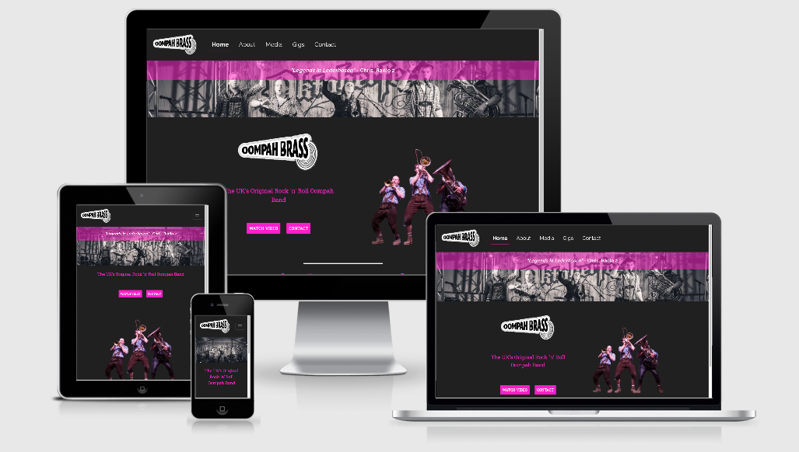
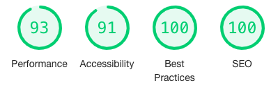
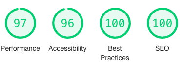
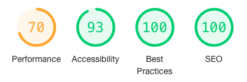
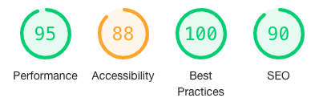
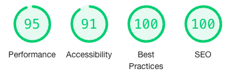

# Website for a band

------

&#127930;&emsp; [View Project Here](https://olihickie.github.io/band_project/)&emsp;&#127930;

&#x1F3B5;&emsp; [View GitHub Repository Here](https://github.com/OliHickie/band_project)&emsp;&#x1F3B5;

This is a website for a group named **Oompah Brass**. They are a five piece brass group whose varied gigs include regular residences, large oktoberfest events, weddings and corporate functions. Their show, which generally includes upbeat pop covers, is upbeat, energetic and fun and the overall aim of their website is to reflect this.

# User Experience (UX)

## User Stories

  - As a potential client visiting the website I want them to:
    - Navigate their way around the website without any help or confusion. 
    - Get a good first impression of the band, that of being both fun and professional. 
    - From the homepage, be able to quickly navigate to a promotional video and a way of contacting the band.  
    - Read a bit about the band, their acheivements, collaborations and past performances. 
    - Read various testimonials from well-known people offering their opinion of the band. 
    - View all external links in a separate window so as to not get taken away from the website. 
    - View inspiring photos designed to encourage bookings.

  - As a fan of the band visiting the website I want them to:
    - Be able to listen to music published by the band.
    - Easily navigate to social media pages in serparate windows. 
    - View a list of upcoming gigs that members of the public are able to go and watch.
    - Follow links to venues of live gigs for more information. 

## Project goals

  - The client wants a website that represents the bands fun and energetic but professional brand. 
  - The website will display examples of the band's work through videos, photos and tracks. 
  - The client would like the website to be user friendly and easy for the site user to make an enquiry or book the band. 
  - The site should display upcoming gigs as well as display media content to help advertise the band's product.

## Design

  - Color Scheme
    The main colors are the bands two signature colors; black and bright pink. I will also you some whites for text to contrast a black background. 

  - Typography 
    The two fonts used are Raleway and Roboto Slab, both with a fallback option of sans-serif. Raleway is used for the quotes on each page while Roboto Slab is used for the bulk of the other text. 

  - Imagery
    Imagery is an important part of the website as it portrays the energy of the band at various gigs they have performed at. Various images will be used around the site to break up text, but the bulk of the images can be found on the media page. 

  - Overall, the website is fairly simple in design with important funcitonal aspects easy to find and carry out, i.e. watch a promotional video of the band or contact with an enquiry. Each page has a specific function and is not too overcrowded. 

## Testing

Throughout the building process, I regularly checked my code on desktop, ipad and mobile screens. Some errors that occureed are documented below:

  - The navigation button appeared when in mobile format, however, when clicked, the menu didn't appear. I then realised I hadn't added the jQuery tags needed and inserted them at the bottom of the page. 
  - Some white lines would appear round the edge of the page. Often this would be corrected by clearing the margin and padding of bootstrap classes. 
  - Whe scrolling down the media page, the navigation buttons for the carousel would appear above the nav bar. To rectify this, I gave the Nav bar a z-index of 100 (1 and 10 were too low a number).
  - The ul items on the Gigs page were slightly off-centre, which was especially visable when in mobile view. Using DevTools, I located a Bootstrap style of 'padding-inline-start' being set to 40px, which I cancelled out in my style.css page. 

### Lighthouse

I conducted tests using the Lighthouse feature on Chrome DevTools and after analysing the results, I made the following changes.
  - I added a meta description to the 'head' section of each page to summarise the page for the benefit of search engines. 
  - I added text to the social media icons for screen readers. 
  - I added rel="noopener" to all external links to ensure I don't expose the site to performance or security issues. 
  - On the About Us page, my links initially said 'Click here' and I changed them to more descriptive text, clearly stating the destination of the links. 
  - On the Media page, I added titles to the YouTube and Soundcloud windows. 
  - On the Contact page, I added labels to the form that were only visable for screen readers. 

Overall, this helped improve the performance, accessibility, best practices and SEO scores; the results of which are below.

### Index 

### About Us

### Media

### Gigs

### Contact

changes/bugs:
Index page:
changed bg color of index as solid black was too flat. Slightly, off-black made imgs stand out more.
social icons were too lrg for phone view - added media query. 

white section appearing down RHS of page - clear padding and margin on .row and remove font weight change to buttons. Also, changed homep page buttons to just links. 
Changed Nav bar location and added logo to nav bar. Kept Nav items to the left as didnt look right when centered and having logo on left. 
photo icons was displaying above fixed nav bar - changed z-index to 100.
As index.html doesnt have a page heading, the picture was disappearing. In order to keep using grouped css, i just added some inline styling. 
Changed the format of the contact page to include a form.
Contact page textarea was adjustable and leaving a white section at the bottom of page - changed in css to fixed area. 